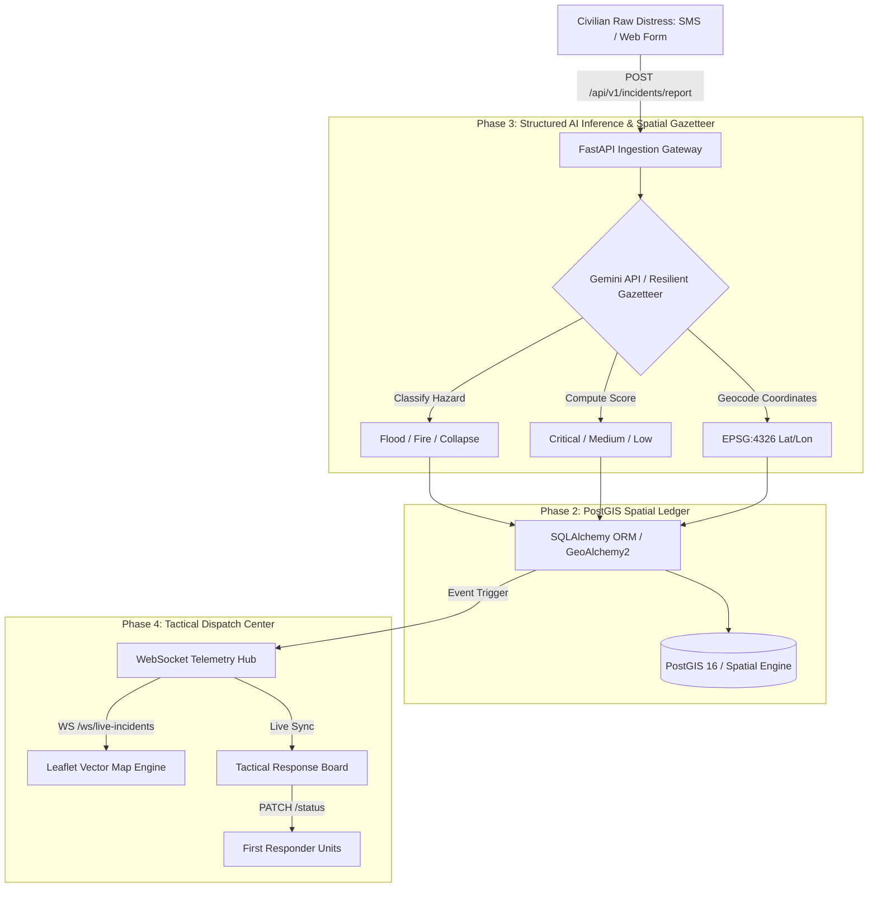

# u-SHA-jua | Sovereign Geospatial Disaster Informatics Platform

[](https://fastapi.tiangolo.com)
[](https://reactjs.org/)
[](https://postgis.net/)
[](https://leafletjs.com/)
[](LICENSE)

**u-SHA-jua** is an event-driven geospatial disaster informatics platform built for resilient emergency dispatch and crisis informatics under bandwidth-constrained conditions. Designed for informal settlements and flood/fire/collapse hazard corridors across Kenya and East Africa.

---

## 1. System Architecture



---

## 2. Key Features

- **Civilian Distress Ingestion**: Accepts raw, unstructured distress reports via low-bandwidth SMS or web portals.
- **Asynchronous AI Distress Extraction**: Extracts incident type (`Flood`, `Fire`, `Collapse`), urgency level (`Critical`, `Medium`, `Low`), and resolves landmark coordinates (Mathare, Kibera, Gikomba, Mukuru, etc.) via Gemini API and a deterministic offline spatial gazetteer.
- **Evidence Review & Dispatcher Verification**: Reports can include GPS and up to six photo/video files. Gemini can summarize visible signs in photos as provisional support; it does not verify incidents. A dispatcher explicitly confirms or rejects each report, and only confirmed incidents reveal a hazard-specific safety guide.
- **Mapbox Satellite Context**: An optional Mapbox satellite-streets layer helps orient responders. Satellite tiles are not live imagery and must not be treated as evidence that a reported incident is active.
- **Africa's Talking SMS**: An optional protected inbound SMS webhook creates incidents from SMS, and opt-in reporters can receive a receipt and status updates. API credentials remain server-side.
- **Spatial PostGIS Engine**: Native geometry storage (EPSG:4326) and viewport-bounded spatial feeds (`/api/v1/incidents/spatial-feed`).
- **Live WebSocket Pipeline**: Sub-second push telemetry broadcasting new incidents and status updates to connected emergency operations centers.
- **High-Density GIS Command Dashboard**:
  - OpenStreetMap & Dark Carto tile layers.
  - Urgency-pulsing vector marker clusters (Red Pulsing for Critical rescue traps, Amber for Medium escalating risk, Green for Low/Advisory).
  - Tactical split-screen layout with synchronized vector layers and real-time status controls (`Pending` ➔ `Dispatched` ➔ `Resolved`).
  - Constrained-bandwidth toggle mode for throttled field connectivity.
- **Auditable Quality & Testing**: Pytest test suite covering endpoint validation, coordinate validation, and mocked NLP inference.
- **High-Concurrency Benchmarking**: Asynchronous load-testing harness simulating 50 concurrent incoming SMS distress messages per second with p50, p95, and p99 latency profiling.

---

## 3. Directory Layout

```text
├── .antigravity/
│   └── config.yaml            # Antigravity CLI project config
├── docker-compose.yml         # PostGIS, Backend, and Frontend composition
├── PLAN.md                    # System implementation blueprint
├── server/                    # Python 3.11 FastAPI Backend
│   ├── config.py              # Environment configuration & settings
│   ├── database.py            # PostGIS & SQLite dual-mode DB engine
│   ├── main.py                # Application entrypoint & seeding
│   ├── Dockerfile             # Container specification
│   ├── requirements.txt       # Dependencies
│   ├── models/                # SQLAlchemy & GeoAlchemy2 models
│   ├── schemas/               # Pydantic v2 validation schemas
│   ├── services/              # Gemini NLP service & WebSocket manager
│   ├── routers/               # Incidents API & WebSocket endpoints
│   └── tests/                 # Pytest automated test suite
├── client/                    # Vite + React + TypeScript + Leaflet Frontend
│   ├── src/
│   │   ├── components/        # Map, DispatchBoard, Header, StatCards, Modal
│   │   ├── services/          # REST & WebSocket API clients
│   │   ├── types/             # TypeScript interfaces
│   │   ├── App.tsx            # Root application component
│   │   └── main.tsx           # Application bootstrap
│   └── Dockerfile             # Frontend Nginx production container
└── scripts/
    └── load_test.py           # Concurrency & latency percentile benchmark
```

---

## 4. Quickstart Guide

### Option A: Local Development

#### 1. Backend (FastAPI)
```bash
cd server
pip install -r requirements.txt
copy .env.example .env
python main.py
```
*API documentation available at [http://localhost:8000/docs](http://localhost:8000/docs)*

Set `GEMINI_API_KEY` in `server/.env` for text extraction and provisional photo summaries. Without it, text extraction uses the offline parser and photo evidence remains available for dispatcher review. Set a server-side, API-restricted `GOOGLE_MAPS_API_KEY` to reverse-geocode reporter GPS coordinates; the offline gazetteer remains the fallback. Configure a strong `DISPATCHER_API_TOKEN` to enable incident confirmation; the dispatcher enters this token on first use, and the client keeps it only in memory. To enable SMS, configure the Africa's Talking API key, username, and a newly generated `AFRICASTALKING_WEBHOOK_TOKEN`; configure the SMS callback URL with that token. Enable reporter notifications only when a reporter submits a phone number and checks the SMS consent box.

#### 2. Frontend (React + Vite)
```bash
cd client
npm install
copy .env.example .env.local
npm run dev
```
*Access GIS Command Center at [http://localhost:5173](http://localhost:5173)*

Set `VITE_CARTO_API_KEY` in `client/.env.local` to use your CARTO tile key. Browser-exposed map keys should be restricted to the required tile API and allowed origins. Set `VITE_MAPBOX_ACCESS_TOKEN` to a URL-restricted public Mapbox token to enable the satellite-context layer. The regular map works without either key.

---

### Option B: Docker Compose (Full Stack with PostGIS)

```bash
docker compose up -d --build
```

---

## 5. API Reference

| Method | Endpoint | Description |
|---|---|---|
| `POST` | `/api/v1/incidents/report` | Ingests civilian raw distress report, triggers AI geocoding & broadcasts update |
| `POST` | `/api/v1/incidents/report-with-media` | Multipart report with optional GPS and photo/video evidence |
| `PATCH` | `/api/v1/incidents/{id}/verification` | Dispatcher confirms or rejects a report |
| `GET` | `/api/v1/incidents/{id}/evidence/{evidence_id}` | Reads evidence attached to a report |
| `POST` | `/api/v1/integrations/africastalking/sms?token=...` | Protected Africa's Talking inbound SMS callback |
| `POST` | `/api/v1/incidents` | Direct manual incident creation |
| `GET` | `/api/v1/incidents` | Query incidents with filters (`status`, `incident_type`, `urgency_level`) |
| `GET` | `/api/v1/incidents/spatial-feed` | GeoJSON FeatureCollection bounded by viewport query parameters |
| `PATCH` | `/api/v1/incidents/{id}/status` | Updates triage state (`Pending`, `Dispatched`, `Resolved`) |
| `WS` | `/ws/live-incidents` | Real-time WebSocket event stream |
| `GET` | `/health` | System health check |

---

## 6. Verification & Benchmarking

### Automated Test Suite
```bash
cd server
pytest -v
```

### 50 Concurrency Load Benchmark
```bash
python scripts/load_test.py
```

---

## 7. License
Apache License 2.0. Built for humanitarian disaster informatics and community crisis resilience.
